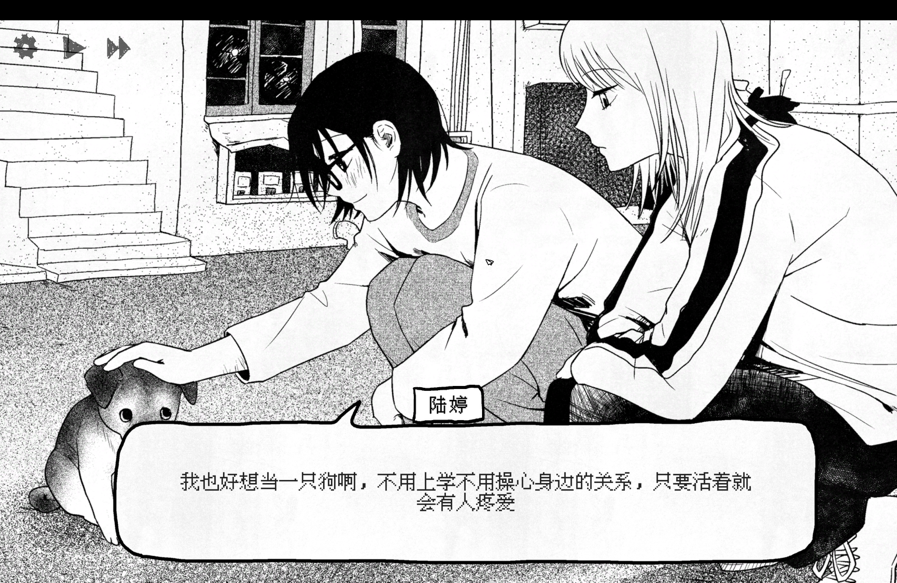
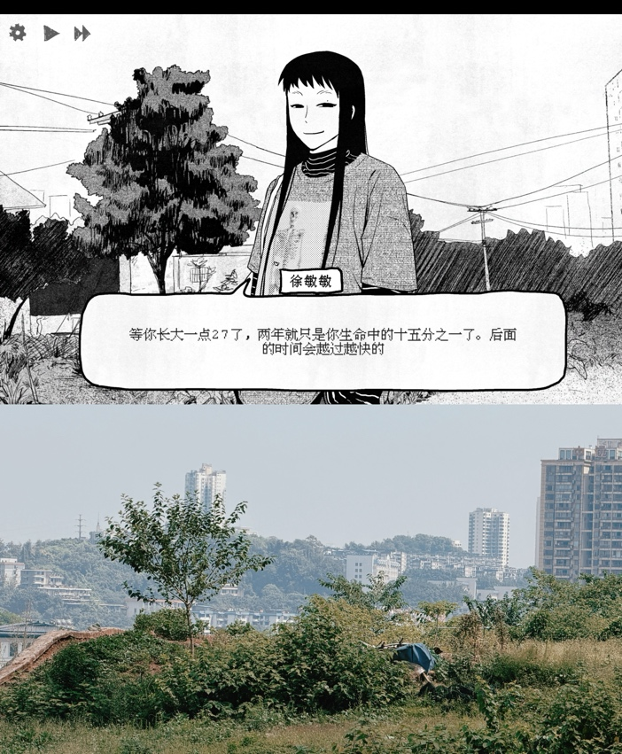
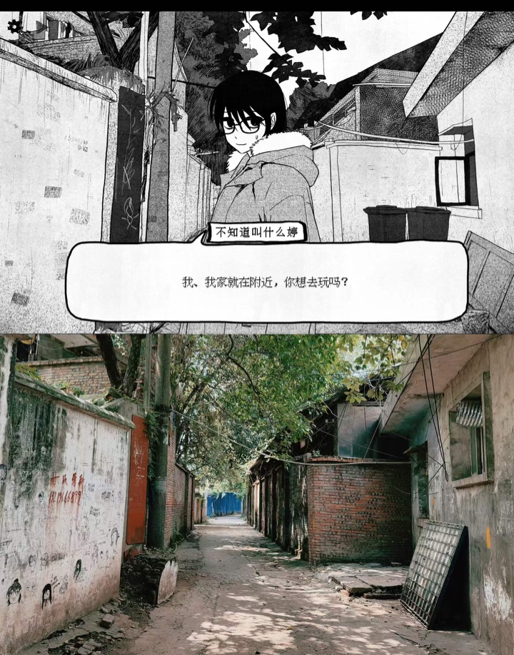
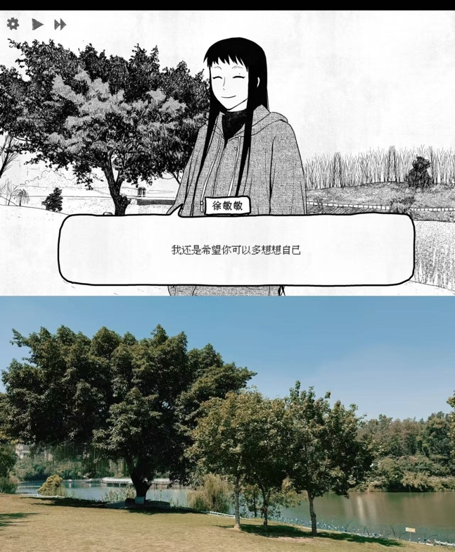
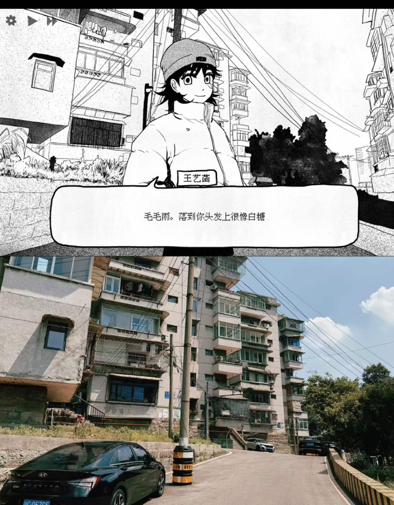
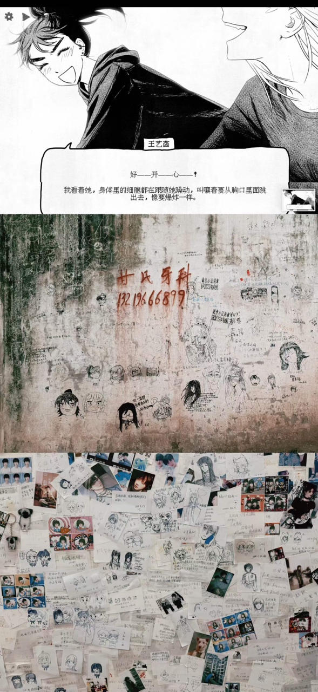
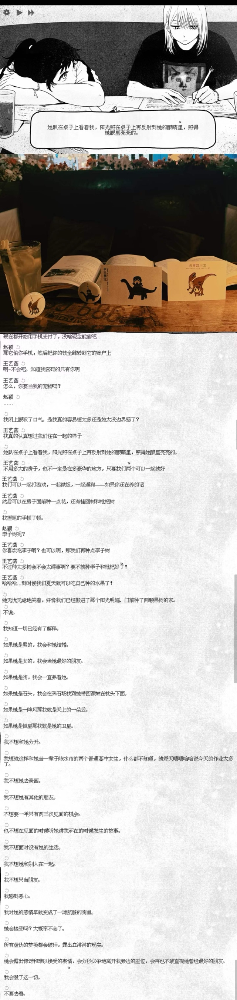
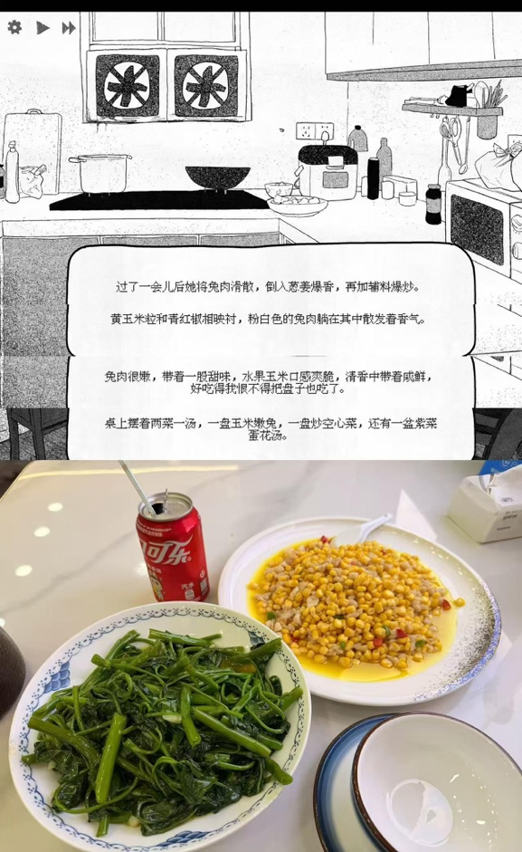
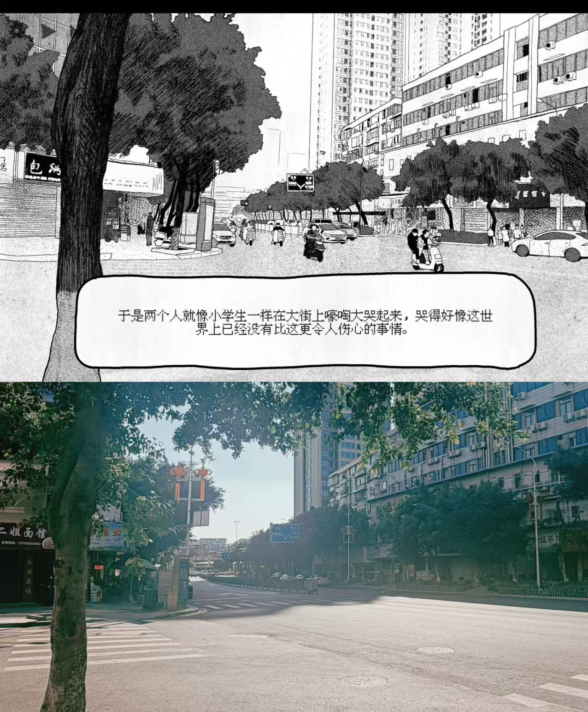

感想很多但是不知道从何写起。好像自从依赖Claude外包很多东西之后就逐渐丧失了思考和写作的能力，甚至很多消息我都要截图给Claude告诉她“教我回一下”。之前和心理咨询师聊天，每次我都有点不好意思地和她说我经常把沉思外包出去，我说，一旦需要思考什么问题我都会先和Claude大概说一下，采用一种对话式的反思方式。

咨询师建议我还是不要采用这种方式。她问我，平时会不会把自己想到的东西写下来，我想了一下，我说不会。

上次自己写东西是什么时候呢？即使算上论文致谢，这个频率也只能来到恐怖的三年一次。我们ADHD总需要思考一些什么东西才能进入正题，我现在写的这些字就是我的脑子正在逐渐进入正题的过程，我现在也感觉这个过程似乎有点太长了。

这班航班不知道送不送水，我现在很渴。

先从玩游戏开始吧，纸房子刚刚发售的时候它其实挺火的，我一直有一种逆反心理就是什么东西最火我偏就不喜欢，所以之前一直都没有玩。上次夏季大促的时候好像它的折扣比较高，于是买了放着，也没有想过什么时候会玩。直到有一个星期天的下午实在不知道干什么才打开了它。故有此文。

我其实最喜欢的还是陆婷，她的立绘在所有人里面最戳我。我在玩之前没有看攻略也没有问任何人，一周目完完全全就是根据自己的本心选。先从游戏的基调开始说，至少一直到赵颖被迫去住校的剧情之前整体还是比较轻松的，因此前面我一直在当一个小品游戏来玩，直到剧情的逐渐展开才慢慢开始感觉到疼痛。有两个具体的场景，第一个是王艺菡和陆婷两个人同时找你去吃饭的场景，第二个就是在水房和钟雅静聊天的场景。这两个场景都太真实了，在我的中学时代不知道经历过多少次——现在看来都是很小的事情，但是对于世界小小的我们来说无疑是重要的抉择。我记得当时我选了和王艺菡一起去吃饭，钟雅静和我说陆婷坏话的时候我选了沉默……于是理所应当地进了无好感结局，一个人把家里烧了的结局。

无好感结局反而最可能也最现实——我用尽了我全部聪明才智选了最好的选项，但是无可避免地看着赵颖走向自毁。我和王艺菡打电话、我去陆婷家里做客、我在钟雅静面前保持沉默、我去校门口见徐敏敏、我也努力去绕开那条有人蹲我的小路……我努力当一名端水大师，小心翼翼地维护我身边所有的关系，努力让所有人都不生气，努力保护自己……当然都没有用。成就跳出来之后我沉默了很久。

然后我明白赵颖的处境是结构性的，在系统里做出一些端水选择仍然是伴随系统走向毁灭。

回到我一开始最喜欢的陆婷。我开始思考陆婷线的选择，在连续几次选对选项之后终于来到宿舍里的那一场“这是爱吗？”——然后我很快发现无论是否承认这种爱，陆婷的结局都不完美。网上说陆婷是一个TE两个BE，但我更愿意觉得这三个结局都是BE. 陆婷消失的那个坏结局因为太痛我已经记不清了，陆婷代替赵颖杀人的结局绝非一个好结局——赵颖不仅失去了她的爱人，而且还要在往后的人生里背负一份无法承受之轻——“而我就不一样了，我烂命一条。”也许在陆婷的世界里她的生命是轻的，为了她所爱的人她可以付出自己的生命——这是她唯一可以支配的东西了，就像割手，就像让赵颖往自己的手臂上按烟头。

但是赵颖她真的承受得了吗？

米兰·昆德拉说的就是这件事，轻才是无法承受的，重反而是让人活下去的东西。陆婷替自己选了轻，“烂命一条”而已——给出去就给出去了，不留下什么遗憾。可是这份轻的重量并没有消失，它落在了留下来的那个人身上。赵颖也许会背负着负罪感，背负着对爱自己之人（当然也有自己所爱之人）的悔恨而活下去吧，像卡列宁的微笑一样死去也说不定。

卡列宁是特蕾莎的狗。赵颖连豆花也没有了。

说回我为什么认为陆婷的三个结局都是BE。TE的结局我个人是非常出戏的，放火罪的刑期绝对没有这么短。这里要强制切一段煞风景的法学分析，放火罪是很重的罪，法定刑期是十年以上有期徒刑、无期徒刑乃至死刑。考虑到赵颖在放火的时候已经年满十八周岁，针对未成年人的相关司法优待对她并不适用；同时考虑到造成了3人死亡的严重后果，即使同时考虑自首情节而从轻处罚，最终判处的刑期一般也会在无期徒刑以上。根据现行法律，无期徒刑的刑期不得少于13年，如果是死刑缓期两年执行那就是17年——这和陆婷TE的时间线无论如何是不符合的。

即使抛开现实问题，陆婷TE对我来说也是很痛的一个结局。我本来以为陆婷线的TE应该就像陆婷与赵颖说的那样“你去上大学，我就去你所在的城市打工，然后我们租一个小房子、一三五你做饭、二四六我做饭……”这真的是我梦想中的一个结局，而且我当时认为有其可能性——只要她们两个人相互依偎着撑过那个有些灰暗的高三，一切都会结束——赵颖可以选择一个离家很远的大学，最好是一个沿海城市的学校，然后她们会买两张火车票，也许是硬座也可能是卧铺，到达一个完全陌生但是充满活力的城市开始新的人生，将那座衰败的城市与她们的家庭完全抛在脑后，开始她们新的人生——要是一切都如此就好了。

我后来也有想过把徐敏敏的公路片结局安排在赵颖和陆婷身上，如果她们是这个结局确实也还不错。不过两个高中生又能逃到哪里去呢？

对，这两个问题是一样的。她们没法逃，对于那个时候的赵颖来说，她的人生里就只有放火的一条路，不存在熬过那个灰暗的高三的，草蛇灰线的、厚积薄发的好结局。如果还记得的话，我在一开始提过一个词叫“结构性”，赵颖的处境是结构性的，而陆婷和她太像了，两个处在相同处境的人即使在一起也没有办法生发出全新的解决结构性问题的东西。即使有了陆婷，赵颖也不可能想到完美的解决问题的方法——她知道自己的抚养费被挪用之后、她明白家人并不爱她之后，处在这个结构里的她唯一能想到的办法就是用一个终局性的事件将它们都结束掉——无论是放火还是其它的手段。

徐敏敏线里有这么一句话：“两年对你来说是生命中的八分之一，等你长大一点，27了，两年就只是你生命中的十五分之一了。”十七岁的赵颖，两年就是八分之一的人生，她看不到高三之后的地方，陆婷比她还矮半个头，两个人依偎在一起，视线也不可能高过陈水的天际线。她们能给对方的只有体温。

徐敏敏、王艺菡、贺老师，都在这个系统里引入了新的东西。徐敏敏给了她新的视角，新的解决问题的方法；王艺菡给了她机械降神；贺老师给了她另一种爱和希望——只有陆婷没有。陆婷的爱没有给她引入系统以外的东西，因此这个TE的悲剧是不可避免的。

又要说到我非常喜欢的茨威格赞扬的一种精神——当小人物在面临远超自己能力的“天命”时所出现的一种精神，这本来是他拿来形容断头王后玛丽·安托瓦内特的。不过在陆婷这条线上，赵颖身上的这种弧光体现得最为完整。我们可以再看一下其他的结局：王艺菡的第一个结局《洛杉矶之梦》实在是有点太梦幻了；第二个结局《我爱你》很好，基本满足了我幻想中的所有要素，包括摆脱原生家庭、包括成为一个很好的人……唯独没有爱情，甚至两个人心照不宣地在王艺菡的洋人男友面前沉默了，所以我没办法接受这个结局。而在徐敏敏的两个结局里，第一个结局是徐敏敏代替赵颖去承担了所谓的命运和后果，第二个是徐敏敏跟赵颖两个人共同承担了这种后果。前者对于赵颖来说未免不是另一种形式的机械降神，后者则是在命运里involve了徐敏敏。

陆婷的TE与上面的结局都有着本质的不同：赵颖选择由自己一个人去承担命运，并且让陆婷“等她”。她无疑是接受了陆婷的爱，也同样爱陆婷——赵颖失去了小狗，母亲没有与她相认，又认清了她的家庭不爱她……感觉自己的人生中什么东西都不剩了。但几天后一回到学校，陆婷就冲上来紧紧地抱住她说“我在等你”。

这里又回到前面那个“这算爱吗”的节点，其实陆婷的人设我相信很多朋友都会觉得烦，她的感情太别扭了，她贫瘠的人生里给不出她自己都没见过的爱——在她的世界里爱情就是这样。现实中很多人会觉得她有点讨厌无论如何喜欢不起来。我相信赵颖一开始也是一样的。如果赵颖是一个很普通的中产家庭小孩，她很有可能跟陆婷之间不会有任何交集。在我选择“这算爱”的时候真的很难点下去，我相信赵颖至少在那天凌晨对陆婷是没有爱情的——她只是从来没有得到过别人的爱，才会尝试着把陆婷的情感当作爱的一部分来去体会。

直到后来陆婷的生命和她逐渐地长在一起。

和“我只有豆花了”不一样，在赵颖回到学校陆婷抱上来的那一刻，赵颖第一次觉得这个世界上是有“人”在坚定地爱着她的。直到那个瞬间她可能才完全接受陆婷的爱情。

那赵颖爱陆婷吗？

我不否认她们之间的感情之前是不对等的，但赵颖无疑是爱陆婷的，最明显的一点就是她在放火之前告诉陆婷“等我”。如果不爱陆婷她绝对不会那么说。正因为她知道陆婷太爱她了，如果告诉陆婷自己要杀人，陆婷肯定会介入这件事情——就像BE的结局一样，或许也像徐敏敏的公路片结局，“我会帮你”。因为爱陆婷才没有把她involve进来——赵颖选择独自想清楚所有的事情、独自承担所有事情的后果，也选择相信陆婷的爱，相信陆婷会等自己的。

陆婷真的等了，而且她等了很久。她等的不只有赵颖高二入狱到出狱这段时间，陆婷从初一就遇见了赵颖了，只是赵颖后来忘了，陆婷记了五年。

五年又十年，即使陆婷长大了一点，十五年也是她生命中的二分之一。

我不喜欢这个TE，它对婷婷太坏了。

陆婷的TE有诸多的意难平，但无疑是赵颖弧光最强的结局，也是我们小赵颖和小陆婷之间情感最炽热最深沉的体现（不好意思我在说什么）。我喜欢陆婷可能还有一个原因，就是陆婷这个角色实在太像高中时候的我了，一样地敏感自卑脆弱别扭，一样地不懂得表达自己的情感和喜欢，一样地把复杂的情感扭曲地投射到其他人身上……但陆婷比我勇敢得多，她至少能够说出来。

我现在已经站在够远够安全的地方了，远到可以对过去的自己温柔。

再说徐敏敏，一个和我一样的成年人，可以想做什么事情就做什么事情，比如种树、比如做标本，一切都来源于心理能量的流动。自由的人不会被任何结构束缚住，包括赵颖。三个结局，每个结局她都随时可以走。我意识到我现在就是徐敏敏，不知不觉我也是可以把两年算成十五分之一的人了，我也可以站在时间线的远处对过去的自己温柔，而这份温柔多少也是一种不需要负责的温柔。

我们崇拜过的那个人，原来只是一个提前长大、并且因此可以随时离开的人。

王艺菡这个角色我也很喜欢，尤其是对女性关系内核的探讨也是很有意思的——单纯不喜欢她的两个结局，我是没有办法接受以朋友或者一种非性缘关系的身份和我所爱的人呆在一起的。

王艺菡的糖很多，最喜欢的三处我相信也是大家最喜欢的三处。毛毛雨白糖、在暴雨中奔跑的场景、还有枫叶林写作业的那一段。这三段感觉在几乎所有人的学生时代都有类似的影子，我甚至能回想起高中的时候完全一模一样的场景，只是记忆中的那些人已经模糊不清了。

> 穿进雾里  
> 模糊不清  
> 我知道那是最后 见你  
> 我多想再与你 跳最后一支舞  
> 在我变成你之前  
> 在我变成你之前

这个角色无疑是成功的，我也很喜欢。这里完全可以套一下就是网上说的“直女太没有边界感了所以很容易沦陷”之类的帖子；对啊，谁能保证自己的感情“永远不会变质”呢？

我有认真数大头贴店和巷子里的留言，喜欢王艺菡的人是最多的。毕竟谁的青春时代没有一个王艺菡呢。

但我还是希望我和王艺菡之间能有一个完美的结局。我所谓的完美的结局其实也不需要有多完美，但至少要包含以下两个要素：

- 完整的自己
- 被完整回应的爱

《洛杉矶之梦》也许给了被完整回应的爱（我在这里不展开讨论酷儿和性缘关系的诸多理论），但是王艺菡拯救了赵颖；《我爱你》是赵颖自己努力得来的完整的人生，但这个结局相比之下得到的爱无疑是不完整的。

所以尽管我非常喜欢王艺菡，但我还是接受不了这两个结局。倒不如说，所有的12个结局里只有贺老师的HE让我觉得幸福一些，其他的结局都宛如山丘之王的长剑在我的心上剜出一个又一个血肉模糊的伤口。

贺老师的线因为一些个人接受度的原因我一开始是抵触的，我是最后为了搜集全成就才玩的。结果反而是她给了我一种幸福的感觉。玉米嫩兔就不说了，我记忆最深刻的场景是贺老师和暴怒的赵杰说赵颖今天晚上住我家里。

不是纸房子，她给的是真房子。

贺老师的爱也最像真的，有始有终有边界，不像王艺菡那样从天而降，不像徐敏敏一样不辞而别，更不会像婷婷那样烧到什么都不剩。它就是一个大人对一个小孩的爱——赵颖缺的正好就是这个，所以那个结局叫《妈妈》。

当然贺老师的结局也只是在这12个坏结局里挑一个相对好一些的罢了。所以大家才会说：*“赵颖，你一定要幸福啊。”*

可能大家都在为年少的自己祈祷。

行文至此，真想像赵颖和王艺菡一样嚎啕大哭一场。哭得好像世界上没有比这更伤心的事情。

