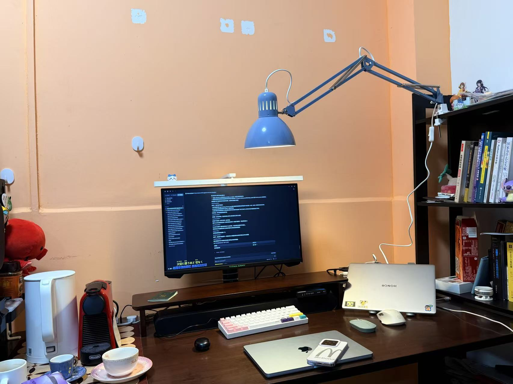
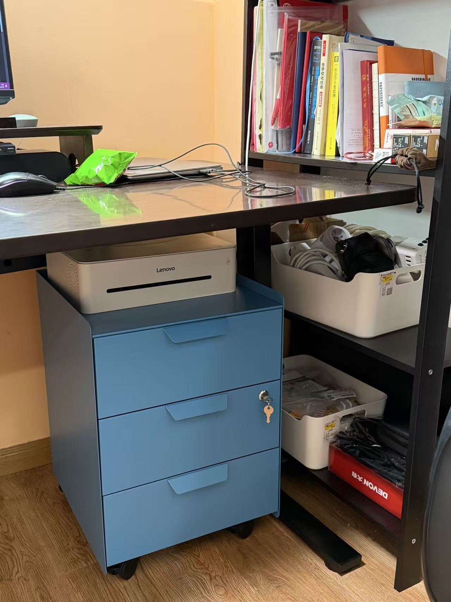
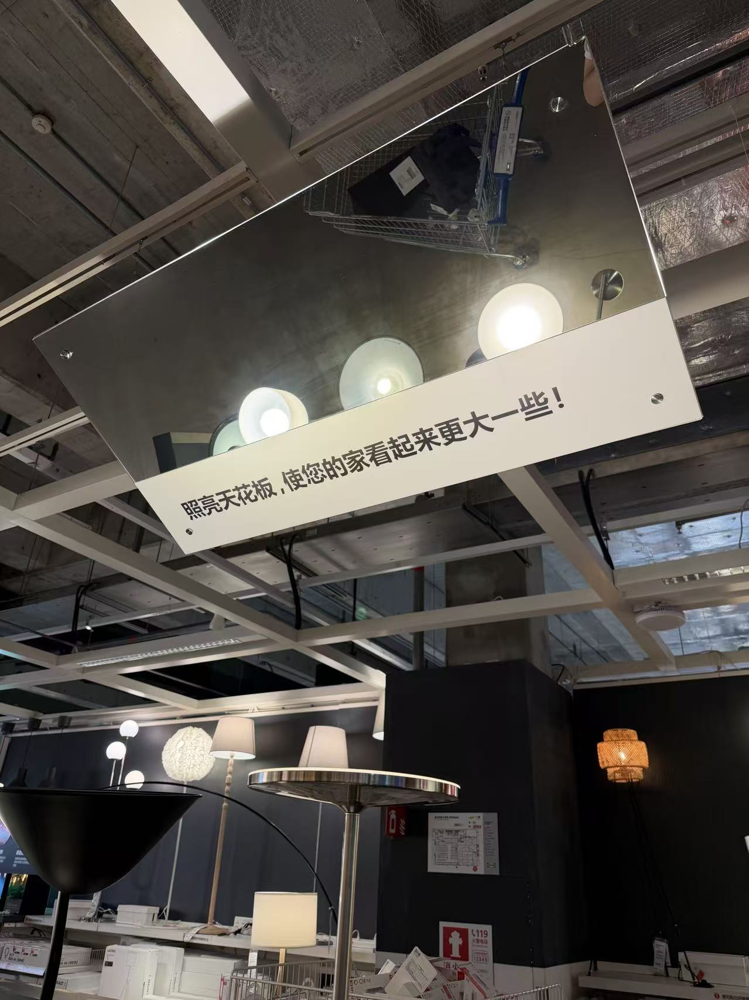
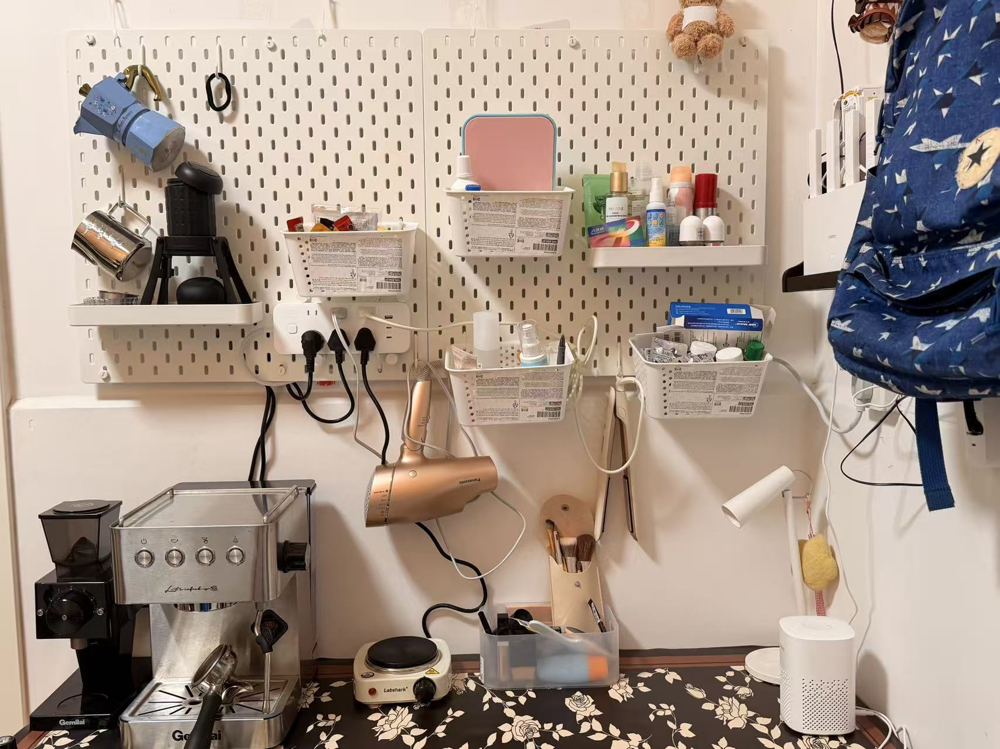

最近算是把人生中的第一个视为住所的经常居所地折腾得差不多了，分享一下我当木工和电工的一些心得。

我是在岭南一个人住，所以对于亚热带季风气候的独居朋友会有比较多的参考的价值，其他地方的朋友也可以当个参考，看看我们岭南人是怎么和恶劣的气候斗争的。

## 先解决生存问题——烘干机和除湿机

先说我心目中排第一的东西。在岭南，如果你没有一个非常大的阳台，乃至说即使有一个超大的阳台，洗衣机、烘干机和除湿机这三件套都是必备的。没在岭南生活过的朋友可能很难体会，回南天的时候衣服挂在阳台上一周，收回来一摸比刚晾上去的时候还湿。有了烘干机之后，晾衣服这个家务就从人生当中直接消失了，再也不用担心天气如何如何，只需要每天晚上睡觉之前把衣服扔进烘干机就好了。

除湿机也是一样的道理，岭南什么东西都能慢慢发霉，等你发现的时候往往已经晚了。所以除湿机必须有，具体买多大的就看户型和面积，宁可买大一点也别买小了。买了除湿机之后就再也不用担心发霉的事情，唯一要做的事就是倒水箱，而且每次倒水的时候都会小小地震撼一下——这么小的房间一天居然能抽出这么多水。当然有条件的还是直接把管子接到下水道，我直接网购了一条十块钱的软管和洗衣机接同一个下水，这样除湿机就是7*24小时运行了，彻底离人不用管。

除湿机我是在闲鱼上收的二手的，小米33L的这一款，整体上我觉得问题是他是圆柱形造型的会占地方别的都挺好。身边的朋友有买美的和德业，也都不错，建议就买一个方形的省地方，甚至还能放到桌子下边。

烘干机我懒得折腾就直接买的小米洗烘套装，目前体验非常满意——除了洗完之后需要把衣服从洗衣机转移到烘干机以外。洗烘一体的机器在5000元以下的价位基本上都是冷凝烘干，烘干温度会高一些，比较伤衣服，有些衣服比如羊毛、羊绒材质之类的会烘不了——而热泵一体机居然都要1w块钱左右，综合下来还是买了单体的热泵烘干机，缺点是确实有点占地方。

烘干机加除湿机这两样，基本就把在岭南的生存问题解决了，心里会踏实很多，剩下的东西都属于锦上添花，可以慢慢来。

## 摆脱出租屋质感，从灯开始

接下来就是如何让自己的家摆脱出租屋的廉价感。我觉得这里面最重要的一件事说出来可能有点反直觉——灯。因为一盏大白顶灯或者LED灯泡把全屋照得惨白，那个氛围其实很像办公室，多好的家具放在那种光底下都会显得有点将就。而且很多出租屋给你配的灯具的照度是完全不够的，白天可能还好，到了晚上就是全家都有点昏昏暗暗的。所以主灯如果是惨白单色且照度不够的，尽可能还是换掉（可以只换主灯的灯盘，这个届时我可以专门写一个文章讲讲）

等咱们换掉主灯之后还有落地灯、氛围灯、工作灯这些层次，晚上把主灯调一下亮度和色温，再留几盏氛围灯，整个家的气质是完全不一样的（至于布光的问题我也会在后续专门说一说！）这里最主要的问题在于，灯一多我们不可能每天回家挨个打开，睡前再挨个关掉。所以结论很自然，如果我们需要认真研究布光，这些灯就得全部是智能的，不然再好的方案也落不了地。

选智能灯，灯的具体型号还是其次，重点还是先挑好智能家居的协议，到时候只能在某个App里控制那就根本不智能。如果是和我一样的小地方，我觉得直接买Wi-Fi协议的就好，市面上能选的也比较多。大户型或者灯比较多（整体用2.4G Wi-Fi的设备会超过20个）的话，可以考虑小米蓝牙Mesh的或者Zigbee等协议的，因为几十个设备全挂在Wi-Fi上，路由器会有点吃不消，也会影响全屋的网络。

布光的具体做法我给个温和的参考，客厅除了主灯再多布两个灯，卧室也一样，床头灯、夹灯这些按自己的生活习惯来就好。也不用追求一步到位，先买一两盏回来感受一下，喜欢再慢慢加，这个过程还挺治愈的。本人这两个月最喜欢的一件事就是去宜家挑灯，激情购入蓝色的夹式台灯（好像叫弗萨）、一盏复古夹灯（好像叫特提亚）、还有一些杂七杂八的小灯。过程当中还涉及到把米家台灯2改成显示器挂灯的一个玩法——这个我就不单独展开了，小红书一搜有很多攻略。

*蓝色的特提亚已经上岗，显示器顶上那根就是米家台灯2改的挂灯*

## 灯都智能了，顺手把全屋智能也搭起来

等灯都换成智能的之后，咱们其实已经一只脚踏进智能家居的大门了，剩下的就是顺理成章地把家里其他设备也接进来，解锁更多玩法。这部分我建议按一个顺序来配置，能少走不少弯路——先选网关，再配智能开关，最后加温湿度计这些扩展配件。

先说网关。温湿度计、无线开关这些小配件，市面上大部分都不走Wi-Fi协议，走的是蓝牙Mesh或者Zigbee，所以得先有一个网关，它们才能连上网。网关我建议大家一步到位，直接买一个可以作为中枢网关的设备，苹果生态的话买个HomePod mini就很好。

顺便展开讲讲盲网关和中枢网关的区别。像普通小爱音箱这类设备就属于盲网关，类似一个传话筒，把蓝牙设备的信号转发到云端，让云端能看到、能控制这些设备，但它自己是不动脑子的，只负责传话，我们设置的那些自动化规则其实都跑在厂商的云端服务器上。所以主要的问题有2个，第一是家里一断网，很多联动就没法工作了；第二是每条指令都要去云端绕一圈再回来，会多一些延迟，以及像我一样的人还会额外担心这里的隐私问题。中枢网关就贴心多了，小米中枢网关、苹果的HomePod和Apple TV都算，它可以把自动化规则存在本地自己执行，断网照样干活，响应几乎是瞬间的。所以如果只是想智能开关灯，买个小爱音箱或者别的牌子的智能音箱就足够了，但如果想要更多可玩性、更顺滑的联动，还是建议配置中枢网关，苹果用户买一台HomePod mini，网关、中枢、音箱输入设备就全部解决了。

接下来是智能开关，这一步非常关键，但最容易被忽略。前面我们配置了智能灯具，但是只要我们一不注意把墙上的开关关掉，智能灯就直接物理断电了，这时候喊Siri或者手机App里操控都是无法重新启动的。所以换了智能灯之后，墙上的开关也得跟着换成智能开关，让灯具保持常通电，开和关都交给智能系统去做。不想动墙上电路的话，也可以退一步，买无线开关贴在原来的开关旁边，再假装原来的开关不存在。

智能开关还分零火版和单火版，具体买什么型号、怎么安装，要看家里布线的情况，不过小米的智能开关是零火单火都能接，虽然稍微贵一些，但是比较省心。

网关和开关都就位之后，就可以往系统里加各种传感器和配件了。我最推荐的是每个房间放一个温湿度计，因为空调、除湿机的联动全都要靠它的读数，湿度高了自动开除湿机，天热了自动开空调。另外家里如果是老式空调也不用急着换，买一个米家的空调伴侣就能把它接进智能家居，照样参与联动，性价比很高。

底子打好之后，配合米家或者别的智能家居生态，就能配置一些基本的智能场景了，比如出门的时候所有设备自动关掉，回家的时候灯光和空调提前自己打开。如果你和我一样是小米和苹果双持用户，还有一个进阶玩法，找一台闲置设备开个虚拟机跑HA，把米家设备桥接进HomeKit，从此就可以用Siri指挥全屋了。不过在不折腾的情况下，用Siri控制的前提是手机连着家里的Wi-Fi，如果想出门在外也能远程控制，要么买一台HomePod当中枢，要么自己研究内网穿透，后面这条路属于比较高级的折腾了，量力而行就好，搞不定也完全不影响日常使用。

## 没有沙发，但有一张很大的桌子

再来说说日常的家具。我家没有沙发，取而代之的是一张非常大的工作桌，它基本就是我家的中心，学习、吃饭、玩游戏都在上面，所以我对桌子是有感情的。我的建议是，桌子这种每天要用无数次的家具还是得买一张好一点的。升降桌可以考虑，但最好不要买入门款，因为入门款真的很晃！！——说的就是你乐歌E2。我后来又做了一些木工活，靠自己动手改造才让它稳下来的，所以如果预算允许，还是一步到位比较省心，把折腾的时间留给更有意思的事情。我的工作椅子买的是宜家一款七字人体工学椅，这个名字真的很拗口，坐起来唯一的问题是坐深太浅，别的我目前用得都挺好。

*桌子底下的空间也别浪费，一个带轮子的抽屉柜刚好塞进去*

## 收纳要往墙上长

小户型要去折腾家具，还有一个很重要的意识，就是收纳要往立体的方向去找空间。这里我强烈推荐宜家的洞洞板，目前我是把咖啡角、化妆品和很多小工具都上了墙，这样桌面和地面能一直保持干净。也可以用高一点的书架（强烈推荐宜家的拉瓦书架，129五层的架子）、或者墙面搁板（如果能打孔），思路都是一样的，地面留白越多，房子看起来就越大——此处又要有宜家那句天才的想法“照亮天花板，让你的家看起来大一点儿。”

*在卖场现场拍到的原话，宜家是懂小户型的*

*咖啡角、吹风机、化妆品全都上了墙，台面能一直保持清爽*

## 最后，不必为了智能而智能

最后我想说的还是，家里并没必要每样东西都搞成智能的。以我目前的体验，布光、空调、温湿度计、除湿机这几样最好都带智能功能，因为它们彼此之间要联动，是整个系统的核心，其他的设备就随缘吧，为了智能而智能反而会给自己添麻烦——虽然我也花很大力气把洗衣机和烘干机接入了HA，但是基本上一周用不到一次他们的智能功能了，毕竟智能又不能帮我把衣服放进去。
